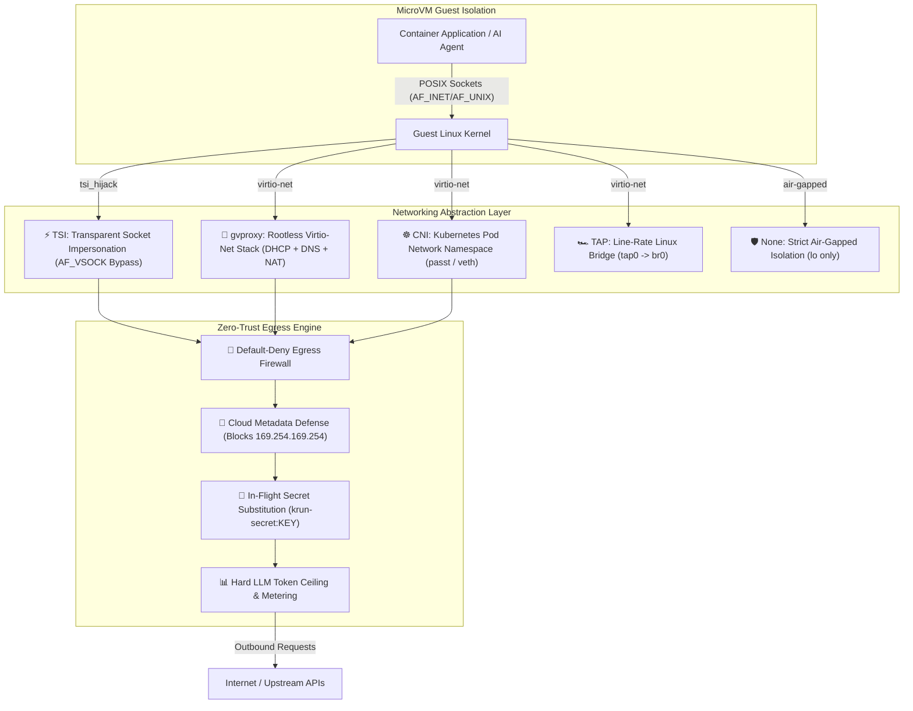

<div align="center">


# ⚡ CroSandbox (`cro`)

### The Premier Pure-Rust MicroVM Virtualization & Orchestration Platform
<p><b>ISOLATE &bull; EXECUTE &bull; CONTROL</b></p>

[](LICENSE)
[%20%7C%20Linux%20(KVM)-black.svg?style=for-the-badge&logo=apple)](https://github.com/CroSandbox/cro)
[](https://www.rust-lang.org)
[](https://github.com/CroSandbox/cro)
[](https://github.com/CroSandbox/cro)
[](examples/krun-compose.yaml)

<p align="center">
  <b>Run standard OCI container images and AI workloads inside hardware-isolated microVMs.</b><br>
  Sub-100ms cold boot times • Apple Silicon Metal & Linux DRM Venus GPU acceleration • Native Docker Compose orchestration • Zero-trust AI agent sandboxing • Zero CGO & zero runtime overhead.
</p>

[Quickstart](#-quickstart-in-30-seconds) • [Why CRO?](#-why-cro) • [Compose & YAML](#-declarative-compose--yaml) • [Architecture](#-architectural-dominance-cro-vs-alternatives) • [AI Sandboxing](#-ai-agent-sandboxing--gpu) • [Kubernetes](#-kubernetes--containerd-integration) • [Commands](#-complete-cli-command-reference) • [SDKs](#-multi-language-client-sdks)

---

</div>

## 🌟 Overview

**cro** is a modern, high-performance virtualization SDK and microVM orchestration suite powered by [`libkrun`](https://github.com/libkrun/libkrun). Built from the ground up in memory-safe Rust, it transforms ordinary OCI container images (from Docker Hub, GHCR, or local registries) into hardware-isolated virtual machines in **under 100 milliseconds**.

Whether you are building **AI coding agent sandboxes** (Claude, Gemini, Codex), running **multi-container microVM stacks with Docker Compose**, deploying **isolated serverless functions**, or orchestrating **Kubernetes Pods with hardware virtualization boundaries**, `cro` delivers true hypervisor isolation with native developer ergonomics. Both `cro` and `microvm` CLI commands are supported interchangeably.

---

## ⚡ Quickstart in 30 Seconds

### 1. One-Line Installation
```bash
# Automated installer for macOS (Apple Silicon) and Linux:
./install.sh
```

### 2. Run Any OCI Container in a MicroVM
```bash
# Boots a hardware-isolated Linux microVM in <100ms:
cro run alpine:latest -- echo "🚀 Hello from cro microVM!"

# Check guest Linux kernel (running isolated on macOS Apple Silicon or Linux KVM):
cro run alpine:latest -- uname -a
# Linux localhost 6.12.91 #1 SMP aarch64 Linux
```

### 3. Deploy Multi-Service Stacks with Docker Compose
```bash
# Start multi-microVM stack (Redis + Web proxy) in background:
cro compose up -f examples/krun-compose.yaml -d

# Check live microVM status and port forwards:
cro compose ps -f examples/krun-compose.yaml

# Stream aggregated service logs:
cro compose logs -f

# Gracefully stop and clean up:
cro compose down -f examples/krun-compose.yaml
```

### 4. Launch an Isolated AI Coding Agent Sandbox with Git Cherry-Pick
```bash
# Isolated workspace with copy-on-write filesystem, git cherry-pick, and auto-sync:
cro sandbox claude \
    --workspace . \
    --cherry-pick 7f4a2b1 \
    --apply-to-host \
    --secret ANTHROPIC_API_KEY=env:ANTHROPIC_API_KEY

# Or cherry-pick any past sandbox commits on demand:
cro cherry-pick <sandbox-id>
```

### 5. Build Container Images In-Process (No Docker Daemon Required)
```bash
# Build an OCI rootfs directly from a Dockerfile using the native in-process engine:
cro build -t my-microservice:1.0 -f Dockerfile .

# Instantly run your newly built image with hardware microVM isolation:
cro run -p 8080:8080 my-microservice:1.0
```

### 6. Run Production Kubernetes Pods with MicroVM Hardware Isolation (`cro kube play`)
```bash
# Launch all containers in a standard Kubernetes Pod manifest (sharing network and volumes):
cro kube play pod.yaml -d

# Gracefully stop and tear down the Pod:
cro kube down pod.yaml
```

### 7. Launch the Unstructured Document Intake & AI Threat Shield (`/unstructured`)
```bash
# Start the Elixir OTP server with Web UI and REST API:
cd krun-microvm/sdks/elixir && PORT=4005 mix run --no-halt

# Open the Web UI:
open http://localhost:4005/unstructured
```

---

## 🚀 Why CRO?

<table>
<tr>
<td width="33%" valign="top">

### ⚡ Sub-100ms Cold Boots
Direct PID 1 static execution (`init.krun`) and instant APFS `clonefile` / Linux `FICLONE` Copy-on-Write rootfs snapshotting. No guest VM image building, no cloud image bloat.

</td>
<td width="33%" valign="top">

### 🛡️ True Hardware Isolation
Hardware virtualization boundary powered by Apple Silicon's `Hypervisor.framework` on macOS and `/dev/kvm` on Linux. Protection against kernel exploits, container escapes, and host tampering.

</td>
<td width="33%" valign="top">

### 🐳 Declarative Compose & CRDs
Drop-in compatibility with **Docker Compose** (`krun-compose.yaml`) and **Kubernetes MicroVm CRDs** (`krun.io/v1alpha1`). Topological dependency resolution with cycle detection.

</td>
</tr>
<tr>
<td width="33%" valign="top">

### 🏎️ GPU Passthrough & DAX
Hardware-accelerated virtio-gpu (Apple Silicon Metal & Linux DRM Venus). Native **VirtioFS DAX window** for zero-copy memory-mapped LLM weights (GGUF, Safetensors).

</td>
<td width="33%" valign="top">

### 🔒 Zero-Trust AI Sandboxing
Automated agent sandboxes with egress domain allowlists (blocks AWS metadata SSRF `169.254.169.254`), in-flight secret substitution, and streaming LLM token budget meters.

</td>
<td width="33%" valign="top">

### ☸️ Native Kubernetes CRI
Official containerd v2 TTRPC shim (`containerd-shim-krun-v2`) and pure-Rust `kube-rs` Operator. Run isolated Pods alongside runc containers with `runtimeClassName: krun`.

</td>
</tr>
</table>

---

## 📊 Architectural Dominance: CRO vs. Alternatives

| Capability | Legacy Docker / runc | AWS Firecracker | Legacy Kata Containers (QEMU) | **`cro` (Pure Rust)** |
|---|:---:|:---:|:---:|:---:|
| **Isolation Boundary** | OS Namespaces / cgroups | Hardware MicroVM (KVM) | Heavy VM (QEMU) | **Hardware MicroVM (`libkrun`)** |
| **Apple Silicon (macOS) Support** | ❌ (requires Linux VM) | ❌ (Linux KVM only) | ❌ (Linux only) | **✅ Native (`Hypervisor.framework`)** |
| **Linux KVM Support** | ✅ | ✅ | ✅ | **✅ Native (`/dev/kvm`)** |
| **Cold Boot Latency** | ~300ms – 1s | ~250ms – 600ms | ~1500ms – 3000ms | **⚡ Sub-100ms (`<90ms`)** |
| **Hypervisor Memory Overhead** | ~30 MB – 50 MB | ~50 MB – 80 MB | ~120 MB – 250 MB | **⚡ < 15 MB razor-thin** |
| **Docker Compose Orchestration** | ✅ (Standard) | ❌ (External tooling) | ❌ | **✅ Native (`cro compose`)** |
| **GPU / Metal Passthrough** | ❌ (Emulated/None on Mac) | ❌ | Complex VFIO | **✅ Native Metal & DRM Venus** |
| **VirtioFS DAX (LLM Weights)** | ❌ | ❌ | Complex block setup | **✅ Zero-Copy Shared Memory Window** |
| **Zero-Trust Egress & Secret Proxy** | ❌ | ❌ (Manual iptables) | ❌ | **✅ Built-in Host Security Proxy** |
| **Direct OCI Execution** | ✅ | ❌ (Requires raw rootfs) | ✅ | **✅ Direct OCI Image & Registry Pull** |

---

## 🐳 Declarative Compose & YAML

`cro` provides first-class support for multi-container microVM orchestration via Docker Compose YAML and Kubernetes CRD manifests.

### 1. Multi-Service MicroVM Spec (`krun-compose.yaml`)
Define your entire multi-microVM topology with dependencies, CPU/RAM allocations, VirtioFS host mounts, port forwards, and environment variables:

```yaml
version: "3.8"
name: demo-stack

services:
  # Isolated Redis Cache MicroVM
  redis:
    image: redis:alpine
    cpus: 1
    memory: 256M
    ports:
      - "6379:6379"
    volumes:
      - "./redis-data:/data"
    command: ["redis-server", "--appendonly", "yes"]

  # Isolated Web Proxy MicroVM
  web:
    image: nginx:alpine
    cpus: 2
    memory: 512M
    depends_on:
      - redis
    ports:
      - "18080:80"
    environment:
      APP_ENV: production
      CACHE_HOST: 127.0.0.1
    volumes:
      - "./html:/usr/share/nginx/html:ro"
```

### 2. Compose CLI Commands
```bash
# Start all microVM services in topological order (redis first, then web):
cro compose up -d

# Check status of running microVM services:
cro compose ps

# Follow aggregated logs across all microVMs with service prefixes:
cro compose logs -f

# Validate and inspect resolved configuration:
cro compose config

# Stop and gracefully clean up all microVM instances and networks:
cro compose down
```

### 3. Kubernetes Declarative MicroVm CRD (`cro apply`)
Deploy single-microVM declarative manifests matching Kubernetes `krun.io/v1alpha1` CRD format:

```yaml
apiVersion: krun.io/v1alpha1
kind: MicroVm
metadata:
  name: alpine-agent
spec:
  image: alpine:latest
  vcpus: 2
  memory: 512M
  port: 18080
  networkMode: tsi
  workspaceCow: "./workspace:workspace"
  sandbox: true
  allowEgress:
    - "*.github.com:443"
    - "api.openai.com:443"
  cmd:
    - "/bin/sh"
    - "-c"
    - "echo '🚀 Running inside hardware-isolated microVM!' && sleep 1"
```

```bash
# Apply manifest directly with one command:
cro apply -f examples/microvm.yaml -d

# Or execute with microvm run:
cro run -f examples/microvm.yaml -d
```

### 4. Local Kubernetes Pod Parity (`cro kube play` & `cro kube down`)

Run standard, production-grade Kubernetes `v1/Pod` YAML definitions directly on your workstation with hardware microVM isolation—**without running Minikube, Kind, or a heavy local Kubernetes cluster**:

```yaml
# pod.yaml
apiVersion: v1
kind: Pod
metadata:
  name: fullstack-pod
  labels:
    app: fullstack
spec:
  restartPolicy: Always
  volumes:
    - name: app-data
      hostPath:
        path: /tmp/cro-data
  containers:
    - name: backend
      image: node:20-alpine
      command: ["node"]
      args: ["server.js"]
      ports:
        - containerPort: 3000
          hostPort: 3000
      env:
        - name: NODE_ENV
          value: production
      resources:
        limits:
          cpu: "2"
          memory: "1024Mi"
      volumeMounts:
        - name: app-data
          mountPath: /data
      shmSize: "256m"

    - name: frontend
      image: nginx:alpine
      ports:
        - containerPort: 80
          hostPort: 8080
```

```bash
# 🚀 Launch the entire Pod (all containers booted in topological order sharing network):
cro kube play pod.yaml -d

# 📊 Check live status of Pod containers:
cro compose ps

# 🛑 Gracefully terminate and clean up all Pod microVMs:
cro kube down pod.yaml
```

- **Zero-Cluster Overhead**: No kubelet, no etcd, no control plane overhead. Each container runs as an isolated microVM with shared inter-service networking and hostPath volumes.
- **Spec Fidelity**: Honors `command` (entrypoint), `args` (cmd), `ports` (`containerPort` & `hostPort`), resource requests/limits (`cpu` & `memory`), `env`, `shmSize`, and `volumeMounts`.

---

### 5. Native In-Process Dockerfile Builder (`cro build`)

Build container images locally from standard `Dockerfile` definitions without needing Docker Desktop, Podman, or any background container engine:

```dockerfile
# Dockerfile
FROM alpine:3.19 AS builder
WORKDIR /build
COPY . .
RUN echo "Compiling application assets..."

FROM alpine:3.19
WORKDIR /app
COPY --from=builder /build/app.sh /app/app.sh
ENV PORT=8080
EXPOSE 8080
CMD ["/app/app.sh"]
```

```bash
# 🔨 Build and tag an OCI image directly into the local microVM cache:
cro build -t myapp:latest -f Dockerfile .

# 🚀 Immediately launch your built image inside a microVM:
cro run -p 8080:8080 myapp:latest
```

- **In-Process Engine**: Zero background daemons. Parses Dockerfiles, runs intermediate steps inside hardware-isolated guest sandboxes, and commits the resulting rootfs using instant APFS `clonefile` / Linux `FICLONE`.
- **Full Directive Support**: Supports `FROM ... AS` (multi-stage builds), `WORKDIR`, `ENV`, `COPY` (with `--from=<stage>`), `ADD`, `RUN`, `CMD`, `ENTRYPOINT`, `EXPOSE`, `USER`, and `LABEL`.
- **Smart `.dockerignore`**: Automatically filters build contexts respecting standard ignore patterns, wildcards (`**`), and negation (`!`).
- **Immediate Local Execution**: Locally built images are indexed in `local_images.json` and immediately available to `cro run` without hitting any remote registry.

---

## 🤖 AI Agent Sandboxing & GPU

### 1. Zero-Trust Coding Agent Sandboxes
Safely execute autonomous coding agents (Claude, Gemini, Codex, Dev) without exposing your host machine or sensitive credentials:

```bash
# Run an autonomous coding sandbox with Copy-on-Write host mount:
cro sandbox claude \
    --workspace /path/to/my-repo \
    --secret ANTHROPIC_API_KEY=env:ANTHROPIC_API_KEY \
    --cpus 4 \
    --memory 2048
```

- **Isolated Copy-on-Write (CoW)**: Agent modifications remain isolated in temporary CoW storage; your host directory is untouched until committed.
- **In-Flight Secret Substitution**: Injected API keys are replaced by the host proxy in-flight (`krun-secret:ANTHROPIC_API_KEY`); the guest VM never holds the raw credential in RAM.
- **LLM Token Ceilings**: Enforce hard token budgets with `--max-tokens 50000` to prevent runaway API spend.

### 2. Isolated Git Cherry-Pick & Bi-Directional Commit Syncing
Test feature branches or pull requests inside a safe microVM without altering your local working directory:

```bash
# 🍒 1. Cherry-pick a remote or feature commit directly into the isolated sandbox:
cro sandbox dev \
    --workspace . \
    --cherry-pick 3a7b9c1 \
    --apply-to-host

# 🍒 2. Auto-forward host Git identity & bypass container 'dubious ownership' issues:
# The microVM automatically injects your host git author credentials and enables safe.directory

# 🍒 3. Cherry-pick commits back to host on demand from any historical sandbox:
cro cherry-pick <microvm-id> -w .
```

- **In-Guest Cherry-Pick**: Pulls and cherry-picks target commit inside the isolated container before launching the agent or interactive shell.
- **Automatic Host Application (`--apply-to-host`)**: Detects new git commits made by the AI agent in the CoW workspace and cleanly applies them via `git am --3way` upon exit.
- **Zero Risk**: If the cherry-pick conflicts or the agent breaks the codebase, your host files and git history remain pristine.

### 3. Hardware-Accelerated Local LLM Inference
Leverage Apple Silicon Metal or Linux DRM Venus GPU passthrough:

```bash
# Boot mistral.rs inside an isolated microVM with Apple Silicon Metal acceleration:
cro run \
    --gpu --gpu-shm-size 4G \
    --dax 4G \
    -p 1234:1234 \
    ghcr.io/ericlbuehler/mistral.rs:latest
```

### 4. High-Performance AI POSIX Shared Memory (`--shm-size` & `/dev/shm`)

High-performance AI/ML workflows (PyTorch multi-process `DataLoader(num_workers > 0)`, Hugging Face Transformers) and headless Chromium (Playwright / Puppeteer) require dedicated POSIX shared memory. Without it, PyTorch crashes with `RuntimeError: unable to write to /dev/shm`.

`cro` mounts a dedicated `tmpfs` at `/dev/shm` with `mode=1777`:

```bash
# Allocate 2GB of high-speed POSIX shared memory for PyTorch training:
cro run \
    --shm-size 2g \
    --gpu \
    --gpu-shm-size 4G \
    pytorch/pytorch:latest -- python train.py

# Or run headless browser automation without shared memory crashes:
cro run --shm-size 512m mcr.microsoft.com/playwright:v1.45.0
```

- **Dual-Layer Hardened Sticky Bits**: Guarantees `/tmp`, `/var/tmp`, and `/dev/shm` maintain world-writable sticky bit permissions (`0o1777`) across both host layer unpacking and guest PID 1 initialization, completely eliminating unprivileged permission traps (`_apt`, `postgres`, `nginx`).

---

## 🌐 Advanced MicroVM Networking & Zero-Trust Security

`cro` provides a versatile, defense-in-depth networking architecture engineered for everything from local rootless development to multi-tenant cloud Kubernetes clusters:



### 1. Network Driver Modes Comparison

| Mode | Backend | Isolation Level | Root Required? | Virtual NIC (`eth0`) | IP / Subnet Assignment | Latency / Overhead | Recommended Workload |
| :--- | :--- | :--- | :---: | :---: | :---: | :---: | :--- |
| **`tsi`** *(default)* | AF_VSOCK In-Process | Socket Impersonation | ❌ No | Loopback only | Host-Shared (`127.0.0.1`) | Near 0ms / Zero-Copy | Developer containers, CLI tools, high-IOPS web services |
| **`gvproxy`** | Virtio-Net + gVisor | User-Space L2 Virtual Switch | ❌ No | Real `eth0` | Virtual DHCP (`192.168.127.2/24`) | < 1ms / Micro-virtualized | Rootless desktop VMs, VPNs, custom routing, raw packet sockets |
| **`cni`** | Virtio-Net + Netns | Kubernetes Pod Namespace | ❌ No (via CNI) | Pod Veth / Passt | CNI IPAM Subnet | Line-rate bare metal | Kubernetes Pods, containerd CRI, Kind/K3s/EKS-A clusters |
| **`unix`** | Virtio-Net | External User-space Switch | ❌ No | Real `eth0` | Switch Assigned | Minimal | Custom SDN proxies, vfkit on macOS, QEMU bridge |
| **`none`** | No interfaces | Physical Isolation Boundary | ❌ No | Loopback only | None (`127.0.0.1` only) | Zero Network | High-security untrusted code execution, air-gapped sandboxes |

---

### 2. First-Class CLI Network Management (`cro network`)

Manage, inspect, and diagnose microVM networks with dedicated native commands:

```bash
# List all active microVM networks, modes, IPs, and port mappings:
cro network ls

# Detailed deep-dive into a microVM's network stack & security rules:
cro network inspect <vm-id>

# Tabulate active published host-to-guest ports with direct local endpoints:
cro network ports

# Run live in-guest network connectivity, DNS resolution, and egress diagnostic probes:
cro network test <vm-id> api.openai.com
```

#### Example Output: `cro network inspect`
```text
🌐 MicroVM Network Topology & Security: vm-49fa81
-----------------------------------------------------------------
  Status:              ● Running (PID 28419)
  Network Mode:        gvproxy (rootless virtio-net)
  Guest IP Address:    192.168.127.2
  Virtual Gateway:     192.168.127.1
  Virtual MAC:         5a:94:ef:e4:0c:ee
  Interface MTU:       1500
  Guest Hostname:      ai-worker
  DNS Resolvers:       8.8.8.8, 1.1.1.1
  Port Mappings:       0.0.0.0:8080 -> 192.168.127.2:80
  Allowed Egress:      api.openai.com:443, *.github.com:443
  Metadata Defense:    Active (169.254.169.254 exfiltration blocked)
  In-Flight Secrets:   Active (Zero-Trust header/body substitution)
  LLM Token Ceiling:   50000 tokens
  Egress Proxy Server: 127.0.0.1:41823
  Virtual Switch Sock: /Users/apple/.cache/krun-microvm/instances/vm-49fa81/gvproxy.sock
```

---

### 3. Zero-Trust Egress Filtering & In-Flight Secret Masking

Secure autonomous AI agents, multi-tenant workflows, and untrusted code from exfiltrating credentials or cloud infrastructure keys:

```bash
# Run with strict default-deny egress (only OpenAI and GitHub permitted):
cro run \
    --allow-host api.openai.com:443 \
    --allow-host "*.github.com:443" \
    --secret OPENAI_API_KEY=env:HOST_KEY \
    --max-tokens 50000 \
    python:3.11-slim
```

1. **Default-Deny Egress**: All outbound connections outside the `--allow-host` whitelist are immediately dropped.
2. **Cloud Metadata Defense**: Access to AWS/GCP/Azure instance metadata (`169.254.169.254`) is strictly blocked by default.
3. **In-Flight Secret Substitution**: The microVM only receives an opaque placeholder token (`krun-secret:OPENAI_API_KEY`). The host egress proxy transparently replaces it on the wire with the real secret, so untrusted code can **never read the actual API key from disk or memory**.
4. **Hard LLM Token Budget**: Outbound SSE streams and JSON payloads are inspected in real time. Connections are terminated the instant the cumulative token threshold is exceeded.

---

### 4. Multi-MicroVM Compose Networking & Service Discovery

Services deployed with `cro compose` automatically receive inter-service DNS discovery:

```yaml
# krun-compose.yaml
version: "krun/v1"
services:
  web:
    image: nginx:alpine
    ports: ["8080:80"]
    depends_on: ["api"]

  api:
    image: python:3.11-alpine
    ports: ["5000:5000"]
    depends_on: ["db"]

  db:
    image: postgres:16-alpine
    ports: ["5432:5432"]
```

- **Seamless Name Resolution**: Inside `web`, requests to `http://api:5000` resolve automatically to the API service. Inside `api`, `postgres://db:5432` resolves seamlessly to the database service.
- **Autonomous Resilient DNS Engine**: The microVM engine parses host nameservers, automatically filters broken systemd-resolved loopback stubs (`127.0.0.53` and `127.0.0.1`), and configures resilient fallback resolvers (`8.8.8.8`, `1.1.1.1`).
- **Custom Hardware Attributes**: Set custom MAC addresses and MTUs with `--mac 5a:94:ef:e4:0c:ee` and `--mtu 9000`.

---

### 5. Cloudflare Pingora L7 Reverse Proxy Gateway & Zero-Trust Egress

Integrated directly with [Cloudflare Pingora](https://github.com/cloudflare/pingora) (`0.9.0`), `cro` provides an ultra-low-latency, pure-Rust multi-threaded L7 reverse proxy and ingress/egress gateway:

- **L7 Ingress Routing & Dynamic Service Load Balancing**: Route external HTTP/HTTPS traffic to microVM and Compose backends via longest prefix matching with connection pooling and keep-alive reuse (`cro network pingora --listen 127.0.0.1:8080 --route /api=127.0.0.1:3000 --route /web=127.0.0.1:8000`).
- **Zero-Trust Egress Defense**: High-throughput egress proxy with strict default-deny domain allowlisting, wildcard domain matching (`*.openai.com`), and automatic blocking of cloud metadata service SSRF (`169.254.169.254`).
- **In-Flight Secret Substitution**: Replaces sensitive placeholders (`krun-secret:KEY`) on egress requests with actual secrets directly in Pingora filters before forwarding upstream.
- **Streaming LLM Token Budgeting**: Inspects downstream response chunks to calculate token expenditures and enforce hard token ceilings in real time.

```bash
# Launch a Cloudflare Pingora L7 Reverse Proxy Gateway for MicroVM services:
cro network pingora \
    --listen 127.0.0.1:8080 \
    --route /api=127.0.0.1:3000 \
    --route /web=127.0.0.1:8000

# Launch a Cloudflare Pingora Zero-Trust Egress Proxy with domain allowlisting:
cro network pingora \
    --listen 127.0.0.1:8080 \
    --egress \
    --allow-host api.openai.com:443 \
    --allow-host "*.github.com:443"
```

---

### 6. Unstructured Document Intake & AI Threat Shield (`/unstructured` & Elixir SDK)

`cro` provides an end-to-end **Hardware-Isolated Document Ingestion & AI Threat Shield** accessible via an interactive Cyber-Obsidian Web UI at route **`/unstructured`** and an official **Elixir SDK (`Krun.Unstructured`)**.

#### Why `libkrun Sieve` is Superior to Static Scanners (e.g. Sieve)
- **True Hardware Virtualization**: Executes untrusted document parsing inside an ephemeral Apple Silicon Hypervisor / Linux KVM container booted in **< 75ms** (instead of relying solely on brittle regexes).
- **Zero-Day Parser Exploit Defense**: Protects against PDF parser RCEs (Poppler, Ghostscript, LibreOffice) by confining parsing processes to guest PID 1.
- **VirtioFS Copy-on-Write (`clonefile` / `reflink`)**: Host files are never mutated; all guest writes remain trapped in the isolated CoW layer.
- **Cloudflare Pingora 0.9.0 Egress Interception**: Drops SSRF beacons to AWS/Azure/GCP metadata (`169.254.169.254`) and external C2 listeners.
- **Unstructured.io Schema Elements**: Partitions documents into `Title`, `NarrativeText`, `Header`, `ListItem`, `Table`, and `CodeSnippet` objects ready for LLM / RAG ingestion.
- **Prompt Injection Radar**: Flags and neutralizes indirect prompt injections (e.g. hidden 0.1pt font white-text) and zero-width Unicode steganography.

#### Elixir SDK Usage
```elixir
# 1. Partition an unstructured document into structured schema elements:
{:ok, elements} = Krun.partition("# Financial Report\nQ3 ARR grew by 42%.", filename: "report.md")

# 2. Scan document for AI threats (prompt injection, SSRF, zero-width chars):
{:ok, scan} = Krun.scan_threats(untrusted_pdf_text, filename: "invoice.pdf")
if scan.is_threat do
  IO.puts("Threat quarantined! Risk Score: #{scan.risk_score}")
  IO.puts(scan.sanitized_text) # Clean sanitized text safe for LLMs
end

# 3. Full microVM hardware detonation with live telemetry:
{:ok, report} = Krun.detonate(untrusted_pdf_text, filename: "invoice.pdf")
IO.inspect(report.telemetry)
```

#### Web UI & REST API Endpoints
```bash
# Launch server:
PORT=4005 mix run --no-halt

# Endpoints:
# • GET  /unstructured              - Interactive Cyber-Obsidian Web UI
# • GET  /api/unstructured/health   - Engine health & telemetry metadata
# • POST /api/unstructured/partition- Partition document into JSON elements
# • POST /api/unstructured/scan     - Detect AI threats and return risk score
# • POST /api/unstructured/detonate - Execute microVM detonation & report
```

---

## 🍎 Asahi Linux & m1n1 Boot Integration (Apple Silicon)

`cro` provides native support for booting **Asahi Linux kernels** (`vmlinuz-asahi`, `Image.gz`) and **m1n1 payloads** (`m1n1.bin`, `m1n1.elf`) on Apple Silicon (M1/M2/M3/M4).

```
               +-------------------------------------------------------+
               |        Apple Silicon Host (macOS / Asahi Linux)       |
               |             16KB Memory Page Size Host                |
               +-------------------------------------------------------+
                                          |
                +-------------------------+-------------------------+
                |                                                   |
       [ m1n1 Bootloader ]                                  [ muvm / libkrun ]
   Stage 1/2 Hypervisor & Hardware                      Hardware MicroVM Engine
   Payload (--kernel-format raw)                        Sub-100ms cold boot
                |                                                   |
                +-------------------------+-------------------------+
                                          |
               +-------------------------------------------------------+
               |                libkrun Hardware MicroVM               |
               |              4KB Guest Memory Page Size               |
               +-------------------------------------------------------+
               |  • Asahi Linux Kernel: vmlinuz-asahi / Image.gz       |
               |  • 3D Acceleration: virtio-gpu (Metal / DRM Venus)    |
               |  • High-Throughput I/O: VirtioFS DAX Direct Mapping   |
               |  • x86 Gaming & Emulators: FEX-Emu / Box64 / Wine     |
               +-------------------------------------------------------+
```

### 1. Understanding m1n1 & Asahi Linux Payloads
- **m1n1**: Developed by the Asahi Linux team, `m1n1` serves as the stage 1 and stage 2 bootloader and hypervisor on Apple Silicon. In `cro`, raw `m1n1.bin` payloads can be booted directly with `--kernel-format raw` (`KRUN_KERNEL_FORMAT_RAW`), making `cro` an ideal testbed for low-level Apple Silicon kernel development, hypervisor experimentation, and hardware tracing without risking host instability.
- **Asahi Linux Compressed Kernels (`Image.gz` / `vmlinuz-asahi`)**: Standard Asahi Linux distribution kernels are gzip-compressed ARM64 image binaries (`0x1f, 0x8b`). `cro` automatically inspects the magic bytes and sets `KRUN_KERNEL_FORMAT_IMAGE_GZ`, or allows explicit control via `--kernel-format gz`.

### 2. The 16KB Host vs. 4KB Guest Page Size Problem (Why `muvm` uses `libkrun`)
Apple Silicon hardware operates at **16KB memory page sizes** under both macOS and Asahi Linux to maximize memory bandwidth and TLB hit rates. However:
- The entire x86/x86_64 software ecosystem, including Windows applications, Steam games, and user-space binaries, is hardcoded to **4KB page sizes**.
- Running x86 dynamic translators like **FEX-Emu**, **Box64**, and **Wine / Proton** directly on a 16KB host causes memory corruption, misaligned memory-mapped files, and frequent application crashes.
- **The Solution**: The Asahi Linux project created **`muvm`**, which leverages **`libkrun`** to spin up lightweight Linux microVMs running a **4KB guest kernel** on top of the 16KB Apple Silicon host.
- `cro` brings this exact architecture to developers and engineers with zero-config OCI containers, direct kernel loading, and virtio-gpu passthrough.

### 3. Direct Boot CLI Examples

```bash
# 🍏 1. Boot compressed Asahi Linux ARM64 kernel with rootfs disk and virtio-gpu:
cro run \
    --kernel /boot/vmlinuz-asahi \
    --kernel-format gz \
    --initrd /boot/initramfs-linux.img \
    --disk rootfs.raw \
    --cmdline "console=ttyAMA0 earlycon root=/dev/vda rw" \
    --gpu --gpu-shm-size 4G \
    -c 4 -m 4096

# 🍎 2. Boot m1n1 stage 1/2 raw payload directly:
cro run \
    --kernel /usr/lib/asahi-boot/m1n1.bin \
    --kernel-format raw \
    --cmdline "console=ttyAMA0 earlycon" \
    -c 4 -m 2048

# 🚀 3. Run 4KB-page emulation container with declarative manifest:
cro run -f examples/asahi-microvm.yaml -d
```

### 4. Supported Kernel Formats

| Format Flag | Identifier | Description & Common Targets |
|---|---|---|
| `--kernel-format raw` | `KRUN_KERNEL_FORMAT_RAW` | Flat binary payload, ARM64 uncompressed `Image`, `m1n1.bin` |
| `--kernel-format gz` | `KRUN_KERNEL_FORMAT_IMAGE_GZ` | Gzip-compressed ARM64 Linux kernel (`vmlinuz-asahi`, `Image.gz`) |
| `--kernel-format elf` | `KRUN_KERNEL_FORMAT_ELF` | Uncompressed ELF Linux kernel (`vmlinux`), unikernels |
| `--kernel-format zstd`| `KRUN_KERNEL_FORMAT_IMAGE_ZSTD` | Zstandard-compressed kernel image |
| `--kernel-format bz2` | `KRUN_KERNEL_FORMAT_IMAGE_BZ2` | Bzip2-compressed kernel image |
| `--kernel-format pe`  | `KRUN_KERNEL_FORMAT_PE_GZ` | Compressed EFI PE kernel binary |
| *(Omitted)* | Auto-Detect | Automatic inspection of file magic bytes (`0x1f8b`, `0x28b52ffd`, `\x7fELF`) |

---

## 🛠️ CLI Command Reference

<details>
<summary><b>Click to expand full CLI command catalog</b></summary>

### Lifecycle & Execution
```bash
# Run interactive container shell:
cro run -it alpine:latest -- sh

# Run detached in background (prints container ID):
cro run -d alpine:latest -- sleep 300

# Mount host directories via VirtioFS:
cro run -v /Users/apple/data:data alpine:latest -- ls -la /data

# Forward ports (host:guest):
cro run -p 8080:80 nginx:alpine

# Stream microVM console logs:
cro logs -f <vm-id>

# Copy files between host and microVM:
cro cp ./app.py <vm-id>:/root/app.py
cro cp <vm-id>:/root/output.log ./output.log

# Execute command inside a running microVM:
cro exec <vm-id> -- cat /etc/os-release
```

### State, Monitoring & Telemetry
```bash
# List all microVMs:
cro ps -a

# Live interactive CPU, memory, and thread stats dashboard:
cro stats

# Single-shot telemetry JSON for monitoring tools:
cro stats --no-stream --json

# Pause and resume execution:
cro pause <vm-id>
cro resume <vm-id>

# Dynamically resize CPU and memory of a running microVM without reboot:
cro resize <vm-id> --cpus 4 --memory 2048

# Prometheus metrics scrape endpoint:
cro metrics --listen 0.0.0.0:9090

# Stop and remove:
cro stop <vm-id>
cro rm -f <vm-id>
cro prune
```

### Universal Multi-Boot Engines (Linux, Asahi, m1n1, UEFI & Unikernels)
```bash
# Direct compressed Asahi Linux ARM64 kernel boot (auto-detect or explicit format):
cro run --kernel /boot/vmlinuz-asahi --kernel-format gz --initrd /boot/initrd.img --cmdline "console=ttyAMA0 earlycon" --disk rootfs.raw

# Direct m1n1 stage 1/2 raw payload boot on Apple Silicon:
cro run --kernel /usr/lib/asahi-boot/m1n1.bin --kernel-format raw --cmdline "console=ttyAMA0 earlycon" -c 4 -m 2048

# Direct standard Linux kernel boot with initrd and cmdline:
cro run --kernel /boot/vmlinuz --initrd /boot/initrd.img --cmdline "console=ttyS0" --disk rootfs.raw

# UEFI firmware boot (EDK2 / KRUN_EFI.fd):
cro run --firmware /usr/share/edk2/aarch64/QEMU_EFI.fd --disk os.img

# Boot unikernels (Unikraft, Nanos, OSv):
cro unikernel app.unikraft -c 2 -m 512 --cmdline "netdev.ipv4_addr=192.168.1.2"
```

### Virtual Networking & Egress Security
```bash
# List all microVM virtual networks, driver modes, IPs, and port forwards:
cro network ls
cro network ls --json

# Deep inspect network configuration, MAC, DNS, and firewall policies:
cro network inspect <vm-id>

# View published port forwards across all running microVMs:
cro network ports
cro network ports <vm-id>

# Run live connectivity, DNS resolution, and egress diagnostic probes:
cro network test <vm-id> api.openai.com
cro network test <vm-id> 1.1.1.1

# Launch microVM with custom network mode, MAC address, and jumbo frames:
cro run --net gvproxy --mac 5a:94:ef:e4:0c:ee --mtu 9000 alpine:latest
```

</details>

---

## 💻 Multi-Language Client SDKs

`cro` provides first-class client SDKs across **Python**, **TypeScript/Node**, **Rust**, and **Go**:

<details>
<summary><b>🐍 Python SDK (Serverless <code>@task</code> decorator)</b></summary>

```python
from libkrun_microvm import task, MicroVmBudgetExceededError

@task(
    image="python:3.11-slim",
    cpus=2,
    memory_mb=512,
    allow_hosts=["api.openai.com:443"],
    secrets={"OPENAI_API_KEY": "env:OPENAI_API_KEY"},
    max_tokens=25000,
)
def run_autonomous_agent(prompt: str) -> dict:
    # Executed inside a hardware-isolated microVM:
    return {"status": "success", "prompt": prompt}

result = run_autonomous_agent("Audit security policy")
print(result)
```
</details>

<details>
<summary><b>🌐 TypeScript / Node.js SDK (<code>@libkrun/sdk</code>)</b></summary>

```typescript
import { MicroVm } from "@libkrun/sdk";

const vm = new MicroVm({
  image: "node:20-slim",
  cpus: 2,
  memoryMb: 1024,
  allowHosts: ["api.anthropic.com:443", "github.com:443"],
  secrets: { ANTHROPIC_API_KEY: "env:ANTHROPIC_API_KEY" },
  workspaceCow: "./src:workspace",
});

await vm.start(["node", "-e", "console.log('Running in isolated MicroVM')"]);
const exitCode = await vm.wait();
console.log(`VM exited with status ${exitCode}`);
```
</details>

<details>
<summary><b>🦀 Rust SDK (<code>microvm-core</code>)</b></summary>

```rust
use anyhow::Result;
use microvm_core::MicroVmBuilder;

#[tokio::main]
async fn main() -> Result<()> {
    let mut vm = MicroVmBuilder::new("alpine:latest")
        .cpus(2)
        .memory_mb(512)
        .port_forward(8080, 80)
        .cmd(vec!["echo".into(), "Hello from Rust MicroVM!".into()])
        .run()
        .await?;

    let status = vm.wait().await?;
    println!("MicroVM exited: {status}");
    Ok(())
}
```
</details>

<details>
<summary><b>🔷 Go SDK (<code>krun-sdk-go</code>)</b></summary>

```go
package main

import (
    "context"
    "fmt"
    "log"
    "github.com/CroSandbox/cro/sdk/go"
)

func main() {
    ctx := context.Background()
    vm, err := microvm.New(microvm.Config{
        Image:    "alpine:latest",
        Cpus:     2,
        MemoryMb: 512,
        Cmd:      []string{"echo", "Hello from Go SDK MicroVM!"},
    })
    if err != nil {
        log.Fatal(err)
    }

    _ = vm.Start(ctx)
    exitCode, _ := vm.Wait(ctx)
    fmt.Printf("MicroVM finished: %d\n", exitCode)
}
```
</details>

---

## ☸️ Kubernetes & containerd Integration

`cro` includes an official containerd v2 runtime shim (`containerd-shim-krun-v2`) and a pure-Rust `kube-rs` Operator:

```bash
# 1. Install containerd runtime shim:
cro containerd install

# 2. Register RuntimeClass in Kubernetes:
kubectl apply -f k8s/runtimeclass.yaml

# 3. Launch Pods with hardware virtualization:
kubectl apply -f - <<EOF
apiVersion: v1
kind: Pod
metadata:
  name: isolated-workload
spec:
  runtimeClassName: krun
  containers:
    - name: app
      image: alpine:latest
      command: ["sh", "-c", "echo Hardware-isolated Pod! && sleep 3600"]
EOF
```

---

## 💻 Complete CLI Command Reference

`cro` and `microvm` commands can be used interchangeably:

| Command | Syntax | Description |
| :--- | :--- | :--- |
| **`run`** | `cro run [OPTIONS] <IMAGE> [-- <CMD>...]` | Run an OCI container image, direct kernel, or firmware as a hardware-isolated microVM |
| **`build`** | `cro build -t <tag> [-f <Dockerfile>] [context]` | Build an OCI image from a Dockerfile using the native in-process engine (no daemon) |
| **`kube play`** | `cro kube play <pod.yaml> [-d]` | Play/launch all containers defined in a Kubernetes `v1/Pod` YAML manifest |
| **`kube down`** | `cro kube down <pod.yaml>` | Stop and tear down all containers in a Kubernetes Pod manifest |
| **`compose up`** | `cro compose up -f <compose.yaml> [-d]` | Orchestrate multi-service microVM stacks with dependency ordering |
| **`compose ps`** | `cro compose ps -f <compose.yaml>` | List status and ports of running compose services |
| **`compose logs`** | `cro compose logs -f` | Stream unified, aggregated logs across all microVM services |
| **`compose down`** | `cro compose down -f <compose.yaml>` | Gracefully stop and clean up all compose microVM instances |
| **`apply`** | `cro apply -f <manifest.yaml> [-d]` | Apply any YAML manifest (Compose, Kubernetes MicroVm CRD, or Pod) |
| **`sandbox`** | `cro sandbox <agent> -w <dir> [--cherry-pick <sha>]` | Launch an AI coding agent (Claude, Gemini, Dev) with CoW workspace & secret masking |
| **`cherry-pick`**| `cro cherry-pick <vm-id> -w <host-dir>` | Cherry-pick commits made in an isolated sandbox back to host git repository |
| **`exec`** | `cro exec [OPTIONS] <ID> <CMD>...` | Execute interactive or batch commands inside a live microVM via vsock |
| **`ps`** | `cro ps [-a]` | List running, paused, and recent microVM instances |
| **`stop`** | `cro stop <ID>` | Gracefully stop a running microVM |
| **`pause`** | `cro pause <ID>` | Pause all vCPUs of a running microVM |
| **`resume`** | `cro resume <ID>` | Resume execution of a paused microVM |
| **`rm`** | `cro rm [-f] <ID>...` | Remove stopped microVM instances and release storage |
| **`inspect`** | `cro inspect <ID>` | Display low-level configuration, network topology, and runtime state |
| **`stats`** | `cro stats [<ID>]` | Live resource telemetry (CPU %, RSS memory, vCPUs, PID) |
| **`top`** | `cro top <ID>` | Display supervisor and thread statistics of a microVM |
| **`cp`** | `cro cp <src> <dest>` | Copy files and directories bidirectionally between host and microVM |
| **`logs`** | `cro logs [-f] <ID>` | View and follow console output of a microVM |
| **`snapshot`** | `cro snapshot <ID> [-o <out>]` | Capture an instant CoW snapshot of a live microVM |
| **`restore`** | `cro restore <snapshot>` | Restore a microVM from a snapshot for instant warm-start |
| **`resize`** | `cro resize <ID> -c <cpus> -m <mb>` | Dynamically hot-plug CPU and memory resources of a live microVM |
| **`network ls`** | `cro network ls` | List active microVM network configurations, interfaces, and IPs |
| **`network inspect`**| `cro network inspect <ID>` | Inspect virtual network topology, DNS, egress rules, and proxy servers |
| **`network pingora`**| `cro network pingora --listen <addr>` | Start a Cloudflare Pingora L7 gateway or zero-trust egress proxy |
| **`metrics`** | `cro metrics [--listen <addr>]` | Export Prometheus metrics or serve live Prometheus scrape endpoint |
| **`artifact`** | `cro artifact pull / list` | Manage detached OCI artifacts (LLM weights, datasets, toolchains) |
| **`containerd`**| `cro containerd install` | Install containerd v2 runtime shim (`containerd-shim-krun-v2`) |
| **`preflight`** | `cro preflight` | Run hypervisor preflight checks (macOS Hypervisor.framework / Linux KVM) |
| **`info`** | `cro info` | Display host hypervisor capabilities, cache size, and system state |
| **`prune`** | `cro prune` | Clean up stopped microVM instances and dangling cache directories |

---

## 🏗️ Building from Source

```bash
# Clone with submodules:
git clone --recurse-submodules https://github.com/CroSandbox/cro.git
cd cro

# Build all workspace binaries:
make build

# Sign binaries with macOS Hypervisor entitlement:
make sign

# Run all 134 automated unit and integration tests:
make test
```

---

## 🤝 Community & Contributing

Contributions are warmly welcome! Whether you are fixing bugs, optimizing boot latency, or enhancing SDKs:
1. Fork the repository
2. Create your feature branch (`git checkout -b feature/amazing-feature`)
3. Run tests (`make test`)
4. Open a Pull Request

---

## 📄 License

This project is licensed under the **Apache License 2.0**. See the [LICENSE](LICENSE) file for details.

<div align="center">

**If you find `cro` useful, please give us a ⭐ on GitHub! It helps the project grow.**

</div>
