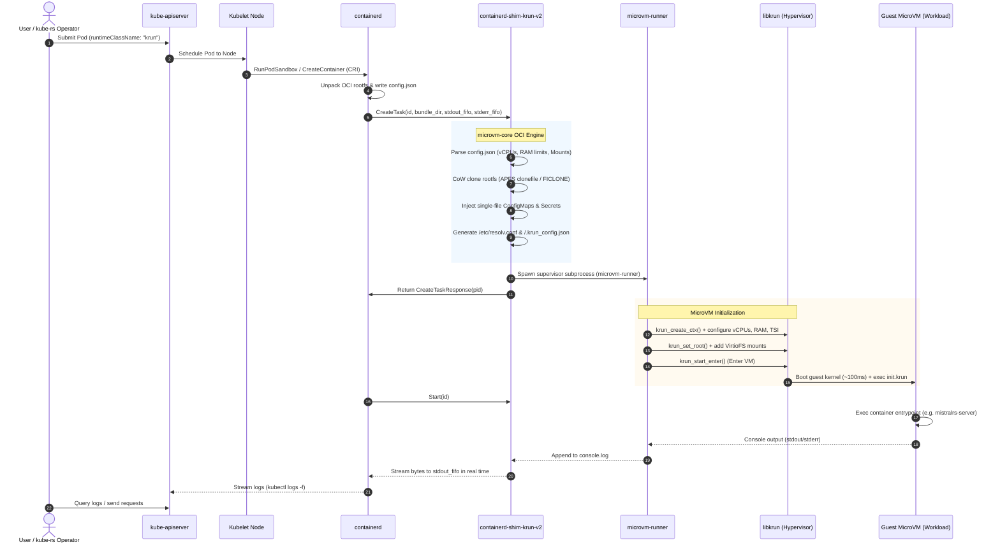

# Architecture Guide: kube-rs, containerd-shim-krun & libkrun

This document explains the end-to-end architecture of running hardware-isolated microVMs in Kubernetes using **pure, idiomatic Rust** from the cluster control plane all the way down to the hardware hypervisor.

---

## 1. High-Level Architectural Stack

```
┌─────────────────────────────────────────────────────────────────────────────┐
│  LAYER 1: CLUSTER CONTROL PLANE & OPERATORS (kube-rs)                       │
│  - kube::Client (API interactions)                                          │
│  - kube::CustomResource (MicroVm / InferenceWorkload CRDs)                  │
│  - kube::runtime::Controller (Reconciliation, state monitoring, auto-scaling)│
└──────────────────────────────────────┬──────────────────────────────────────┘
                                       │ Kubernetes API (HTTPS / JSON)
                                       ▼
┌─────────────────────────────────────────────────────────────────────────────┐
│  LAYER 2: KUBELET & CRI RUNTIME (Node Level)                                │
│  - Kubelet dispatches Pod spec with `runtimeClassName: krun`                 │
│  - containerd resolves CRI request via runtime handler "krun"               │
│  - Unpacks OCI image layers into bundle (/run/containerd/io.containerd.../) │
└──────────────────────────────────────┬──────────────────────────────────────┘
                                       │ TTRPC (containerd v2 Task API)
                                       ▼
┌─────────────────────────────────────────────────────────────────────────────┐
│  LAYER 3: OCI SHIM LAYER (containerd-shim-krun-v2)                          │
│  - Parses OCI bundle (`config.json` + `rootfs/`) via microvm-core            │
│  - Auto-sizes vCPUs & RAM from `resources.cpu` & `resources.memory`         │
│  - Translates directories to VirtioFS and single files to rootfs injections │
│  - Bridges containerd Stdio FIFOs (req.stdout / req.stderr) in real time    │
└──────────────────────────────────────┬──────────────────────────────────────┘
                                       │ Child Process Execution / IPC
                                       ▼
┌─────────────────────────────────────────────────────────────────────────────┐
│  LAYER 4: SUPERVISOR & HYPERVISOR BOUNDARY (microvm-runner & libkrun)       │
│  - `microvm-runner` supervisor process (codesigned with hypervisor ent)     │
│  - `libkrun` creates VMM instance: mounts rootfs, VirtioFS, TSI networking  │
│  - Executes `krun_start_enter()` to boot guest Linux kernel in ~100ms       │
└──────────────────────────────────────┬──────────────────────────────────────┘
                                       │ Hardware Virtualization Extensions
                                       ▼
┌─────────────────────────────────────────────────────────────────────────────┐
│  LAYER 5: SILICON & HARDWARE HYPERVISOR                                     │
│  - Apple Silicon: Hypervisor.framework (ARM64 EL2/EL1 boundary)             │
│  - Linux x86_64 / aarch64: KVM (/dev/kvm VMX / SVM boundary)                │
│  - Guest Linux MicroVM (init.krun PID 1 -> Container Entrypoint)            │
└─────────────────────────────────────────────────────────────────────────────┘
```

---

## 2. Component Deep Dive

### A. `kube-rs` (The Orchestrator / Control Plane)

**What it is:** The official Rust client, runtime, and CRD framework for Kubernetes (analogous to Go's `client-go` and `controller-runtime`).

**Role in the Stack:**
- **Declarative Workload Management**: Instead of writing raw JSON/YAML or shell scripts, Rust applications, CI/CD runners, and AI agent frameworks use `kube-rs` to talk directly to `kube-apiserver`.
- **Custom Resource Definitions (CRDs)**: Allows defining custom Kubernetes types in pure Rust via `#[derive(CustomResource)]`. For example, a `MicroVm` or `InferenceEngine` CRD:
  ```rust
  #[derive(CustomResource, Deserialize, Serialize, Clone, Debug, JsonSchema)]
  #[kube(group = "krun.io", version = "v1alpha1", kind = "MicroVm", namespaced)]
  pub struct MicroVmSpec {
      pub image: String,
      pub vcpus: u8,
      pub memory_mib: u32,
      pub model_weights: Option<String>,
  }
  ```
- **Controller Reconciler**: `kube::runtime::Controller` continuously watches for CRD events and manages backing Pods that request `runtimeClassName: krun`.
- **Log Streaming & Telemetry**: Uses `api.log_stream()` to consume real-time standard output and errors emitted by the microVM.

---

### B. `containerd-shim-krun-v2` (The OCI-to-MicroVM Bridge)

**What it is:** A containerd v2 runtime shim implementation in pure Rust (`crates/containerd-shim-krun`).

**Role in the Stack:**
- **Standard CRI Protocol**: Implements the containerd v2 TTRPC `Task` service (`Create`, `Start`, `State`, `Kill`, `Wait`, `Delete`, `Shutdown`).
- **Dynamic Resource Extraction**:
  - When Kubernetes sets resource limits (`resources.limits.cpu` and `resources.limits.memory`), containerd writes these into the OCI bundle's `config.json` under `linux.resources`.
  - The shim inspects `memory.limit` and `cpu.quota / cpu.period`, dynamically configuring the microVM's allocated RAM and vCPU count.
- **Kubernetes Volume Translation**:
  - **Directory Mounts** (PVCs, emptyDir, hostPath): Mapped as high-speed VirtioFS shared filesystems (`VirtioFsMount`).
  - **Single-File Mounts** (Kubernetes `ConfigMap`s, `Secret`s, and projected service account tokens): Injected directly into the instance rootfs at the exact container destination path before boot.
- **Real-Time Stdio FIFO Streaming**:
  - Containerd creates named pipes (FIFOs) for `stdout` and `stderr`.
  - The shim tails `console.log` from byte 0 and writes bytes directly to containerd's FIFOs in an asynchronous Tokio task, enabling `kubectl logs -f` and `crictl logs` with zero delay.
- **Accurate Process Lifecycle**:
  - Tracks process liveness and populates `WaitResponse` and `StateResponse` with exact exit codes and nanosecond-precision `exited_at` protobuf timestamps.

---

### C. `libkrun` & `microvm-runner` (The Virtual Machine Monitor)

**What it is:**
- `libkrun` is a lightweight Virtual Machine Monitor written in Rust and C that embeds a minimal hypervisor directly into application processes.
- `microvm-runner` is our dedicated supervisor binary (`crates/microvm-runner`) that solves the 2-process supervisor requirement.

**Role in the Stack:**
- **Sub-100ms Boot Time**: Replaces heavy firmware/BIOS boot sequences (UEFI/ACPI) with direct kernel execution (`libkrunfw`).
- **Hardware Isolation**:
  - Memory and compute are strictly isolated inside a hardware hypervisor partition (`Hypervisor.framework` on macOS, KVM on Linux).
  - An adversarial container payload, privilege escalation exploit, or memory corruption bug cannot escape to the host or other tenant containers on the same node.
- **Transparent Socket Impersonation (TSI)**:
  - Proxies guest L4 network sockets (TCP/UDP) directly through the host network stack without requiring bridge devices, root TUN/TAP interfaces, or complex CNI plugins.
  - Combined with our autonomous resilient DNS resolver generator (`/etc/resolv.conf`, `/etc/hosts`), guest processes have instant, secure outbound internet access.
- **Guest Init Contract (`init.krun`)**:
  - `libkrun` launches a minimal static binary (`init.krun`) as PID 1 inside the guest.
  - `init.krun` mounts `/proc`, `/sys`, `/dev`, reads `/.krun_config.json`, applies environment variables and working directory, and calls `execvp` on the container command.

---

## 3. End-to-End Sequence Diagram

The following sequence illustrates what happens from the moment a user or operator schedules a workload until execution inside the microVM:



---

## 4. Why Pure Rust Across the Entire Stack?

Combining `kube-rs`, `containerd-shim-krun`, and `libkrun` creates an entirely Rust-native infrastructure pipeline:

| Dimension | Traditional Go-based Container Stack | Rust MicroVM Pipeline (`krun-microvm` + `kube-rs`) |
|---|---|---|
| **CGO Overhead** | High; Go requires CGO compiler toolchain and wrappers to call C/hypervisor APIs | **Zero**; direct Rust FFI / native crate linkage |
| **Process Model** | 2 processes required to prevent Go M:N scheduler from hijacking VM thread | **Native POSIX processes** with strict RAII resource guards (`RawModeGuard`, `ExitSignal`) |
| **Memory Footprint** | ~30-50 MB per shim due to Go runtime & garbage collector | **< 8 MB** per shim binary; minimal memory footprint |
| **Startup Overhead** | 500ms - 2s per container initialization | **< 150ms** from bundle parse to guest user-space execution |
| **Safety** | Memory safety within Go, but unsafe FFI boundaries with CGO | **End-to-end memory safety** from Kubernetes API client down to libkrun syscalls |
| **Type Safety** | Loose untyped JSON maps or dynamic interfaces | **Compile-time verified contracts** via `oci-spec`, `k8s-openapi`, and `ttrpc` |

---

## 5. Typical Production Use Cases

1. **Multi-Tenant AI Model Serving (e.g. `mistral.rs`)**:
   - Multiple untrusted users query LLM models on shared GPU/CPU nodes.
   - MicroVM boundary ensures prompt injection or model parser vulnerabilities cannot compromise the host.
2. **AI Agent Code Execution Sandboxes**:
   - Automated code generation agents (coding assistants) execute arbitrary code (`python`, `bash`, `docker`).
   - Using `--workspace-cow` with APFS/FICLONE, the agent modifies an isolated copy; host files remain untouched.
3. **Multi-Tenant Kubernetes Clusters**:
   - Untrusted customer workloads run with `runtimeClassName: krun` on existing Kubernetes nodes without managing separate dedicated VM clusters.
